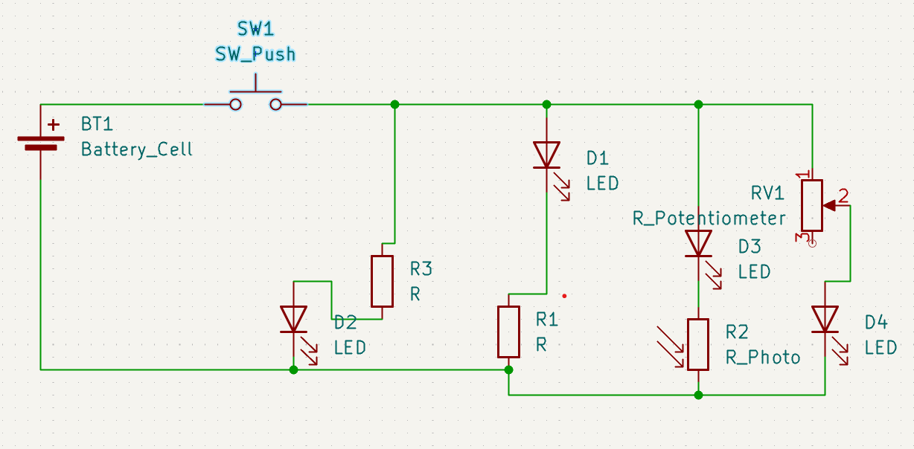
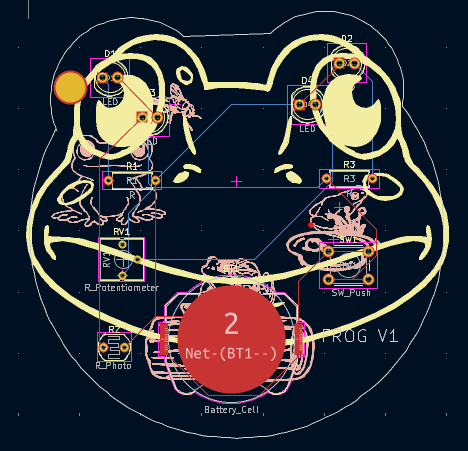
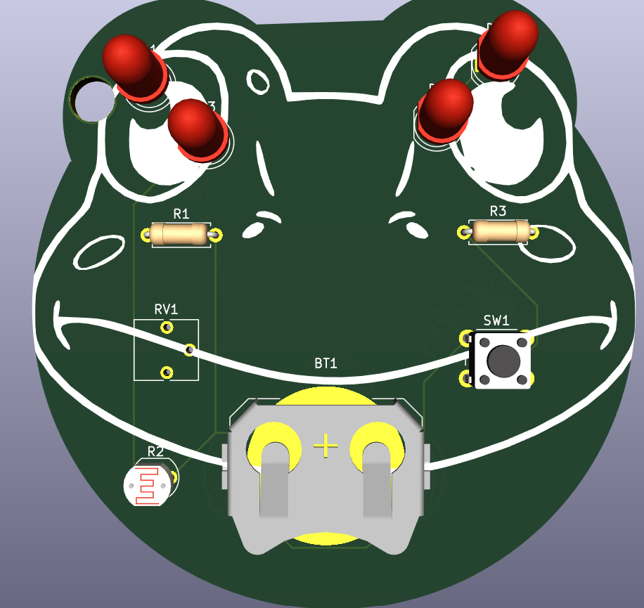
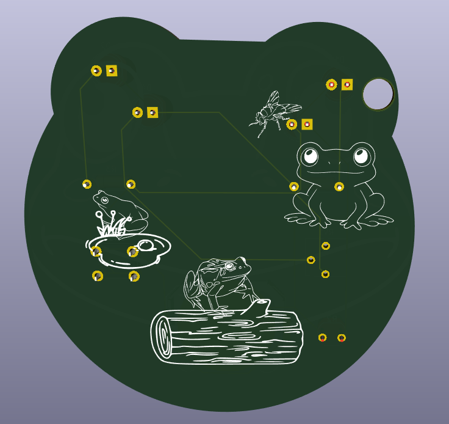

# Frog PCB
A keychain PCB consisting of 4 LEDs whcih are controlled by an LDR, potentiometer and switch  
Schematic:  

PCB:  
  
  
  

BOM:  
1x Battery    
1x SW_Push   
2x 220 ohm resistor  
1x photoresistor  
4x LED  
1x potentiometer  

user: boson
